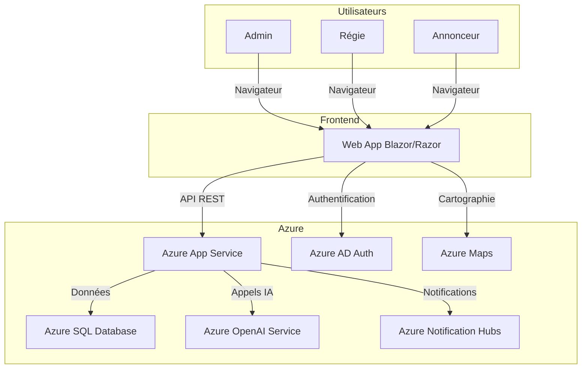

# Backlog Draft

## Epic : Gestion des panneaux publicitaires

### User Story 1 : Visualisation géolocalisée des panneaux
- En tant que régie ou annonceur, je veux visualiser les panneaux sur une carte interactive pour faciliter la sélection.

### User Story 2 : Réservation de panneaux
- En tant qu’annonceur, je veux réserver un panneau à un emplacement précis pour une période donnée.

### User Story 3 : Gestion des réservations
- En tant que régie, je veux valider, modifier ou annuler des réservations.

### User Story 4 : Administration des panneaux et utilisateurs
- En tant qu’admin, je veux gérer les panneaux (ajout, modification, suppression) et les utilisateurs (rôles, accès).

### User Story 5 : Tableau de bord et reporting
- En tant qu’admin, je veux accéder à des statistiques d’occupation et de performance.

### User Story 6 : Recommandations IA
- En tant qu’annonceur, je veux recevoir des recommandations de panneaux selon ma cible, mon budget et la localisation.

### User Story 7 : Notifications
- En tant qu’utilisateur, je veux recevoir des notifications lors des changements de statut de mes réservations.

### User Story 8 : Recherche avancée
- En tant qu’annonceur, je veux filtrer les panneaux par zone, type, audience, etc.

### User Story 9 : Historique et audit
- En tant qu’admin, je veux consulter l’historique des réservations et des modifications pour assurer la traçabilité.

---

# PRD (Product Requirements Document)

## 1. Objectif
Développer une application web Azure pour la gestion, la réservation et la géolocalisation des panneaux publicitaires, intégrant des services IA Azure et un système de notifications.

## 2. Utilisateurs cibles
- Administrateurs
- Régies publicitaires
- Annonceurs

## 3. Fonctionnalités principales
- Visualisation cartographique (géolocalisation) des panneaux
- Réservation en ligne avec calendrier
- Gestion des réservations (validation, modification, annulation)
- Administration des panneaux et des utilisateurs
- Tableau de bord (statistiques, reporting)
- Recommandations IA (Azure OpenAI, recherche intelligente)
- Notifications (email, in-app, SMS)
- Authentification et gestion des rôles
- Recherche avancée et filtres
- Historique et audit

## 4. Contraintes
- Hébergement Azure (Web App, Azure SQL, Azure OpenAI, Azure Notification Hubs)
- Respect RGPD (gestion des données personnelles et de géolocalisation)
- Sécurité (authentification, autorisation)
- Première version front-end en Razor/Blazor

## 5. Critères d’acceptation
- L’utilisateur visualise les panneaux sur une carte interactive
- La réservation d’un panneau se fait en moins de 3 clics
- Les recommandations IA sont pertinentes et personnalisées
- Les notifications sont envoyées en temps réel
- Les données sont sécurisées et conformes RGPD

---

# Architecture (Mermaid)

---

## Suggestions de fonctionnalités additionnelles

- **Gestion des campagnes publicitaires multi-panneaux**
- **Export des données (CSV, PDF)**
- **Gestion des médias (visuels des campagnes)**
- **Module de facturation et paiement en ligne**
- **Support multilingue**
- **Gestion des droits avancée (sous-rôles, permissions fines)**
- **API publique pour intégration avec d’autres outils**

---

As-tu des préférences sur les canaux de notifications ?  
Souhaites-tu prioriser certaines fonctionnalités pour le MVP ?  
Y a-t-il des intégrations externes à prévoir (paiement, CRM, etc.) ?