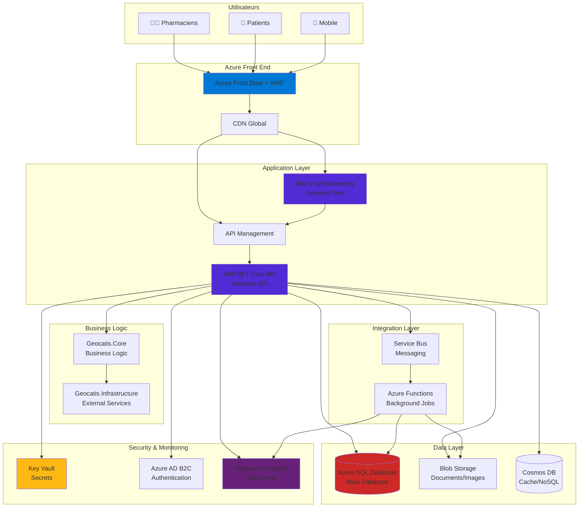
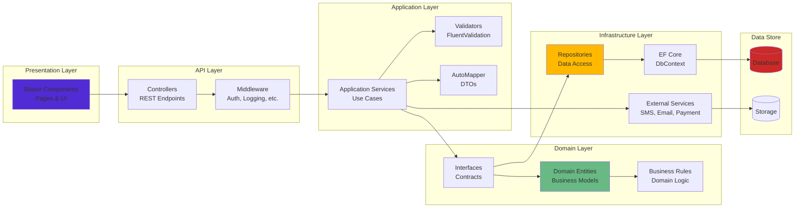
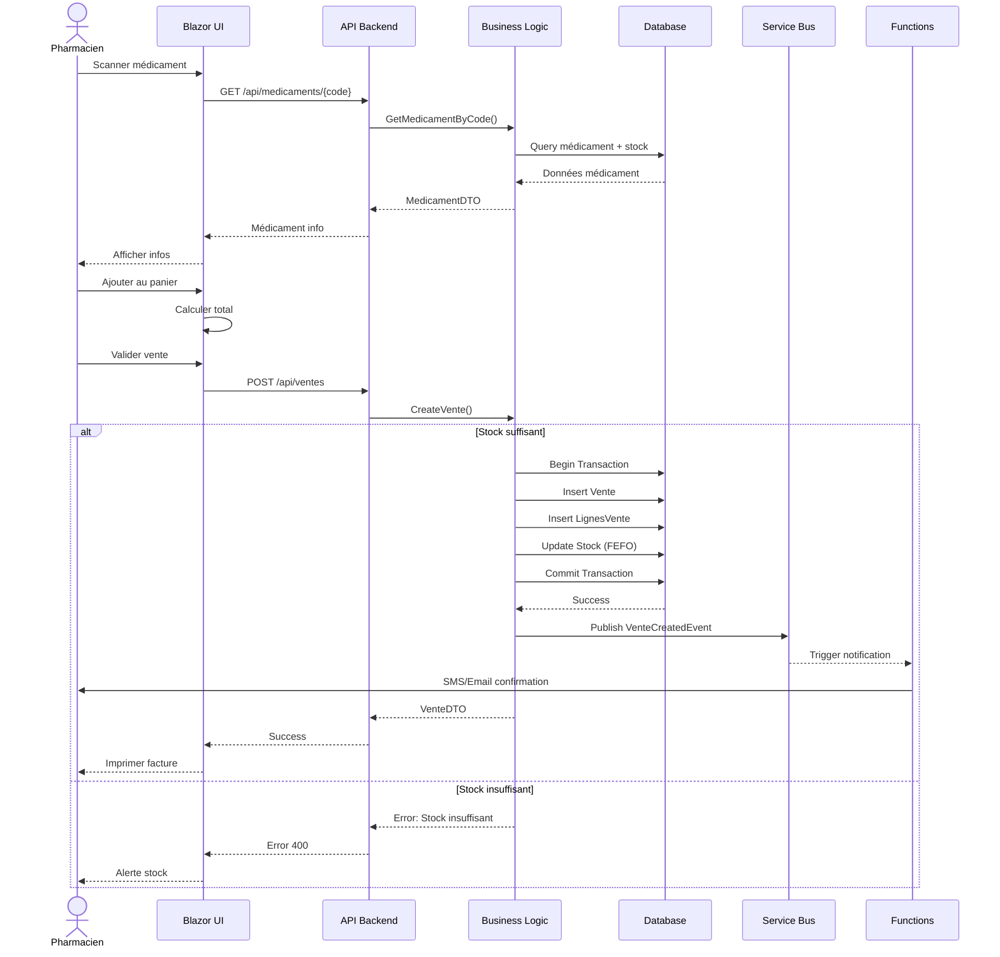
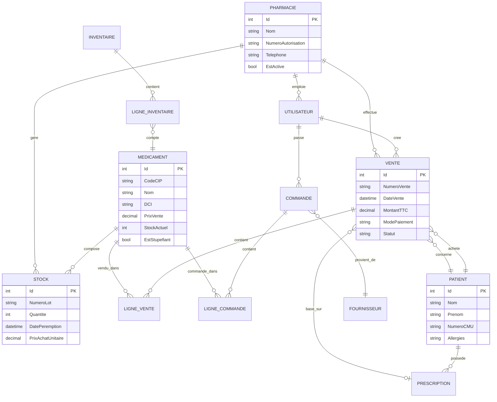
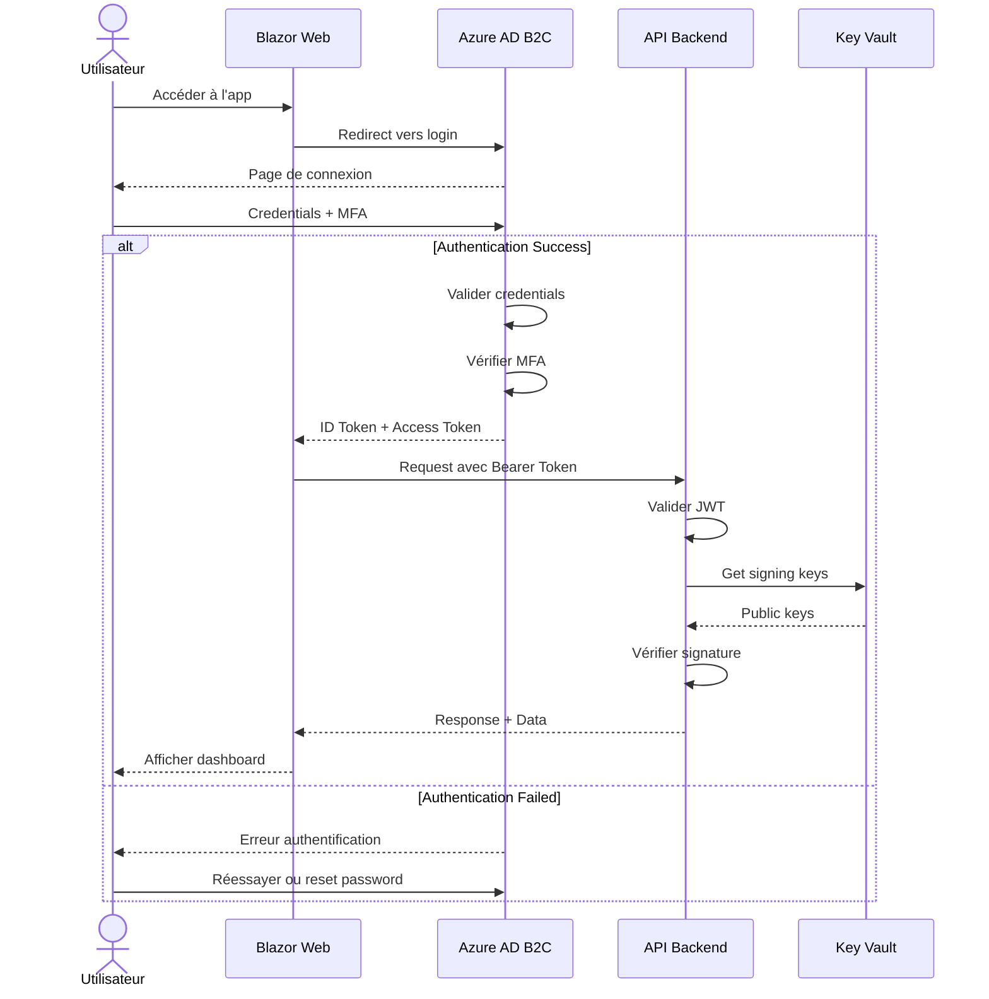
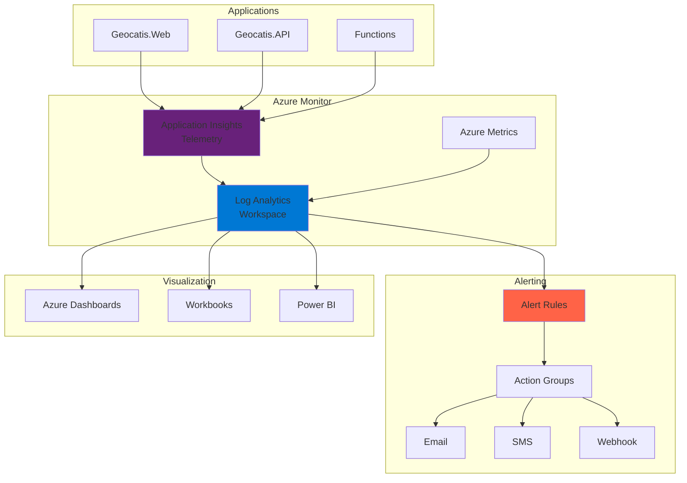
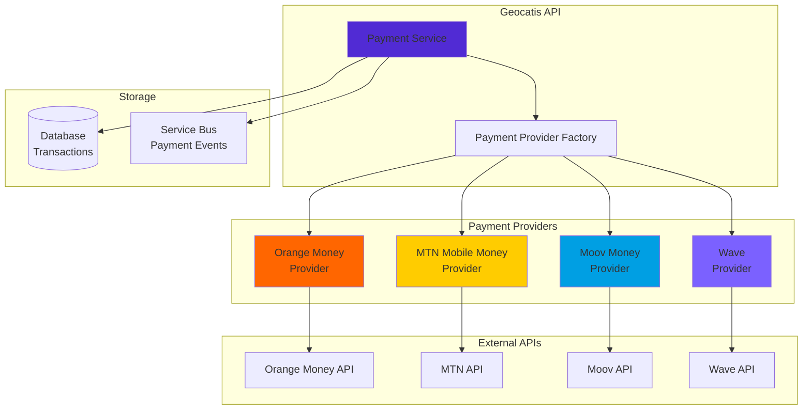
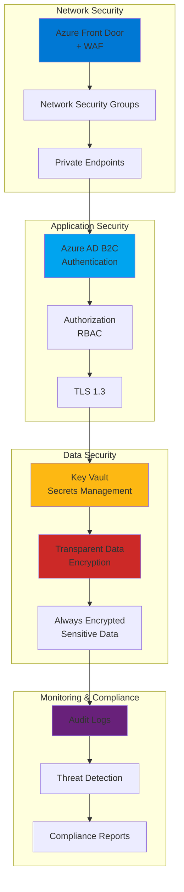

# Diagrammes et Visualisations - Geocatis

Ce document contient les diagrammes architecturaux et visuels de l'application Geocatis.

## Architecture globale Azure

## Architecture applicative .NET

## Flux de vente

## Modèle de données (Relations principales)

## Flux d'authentification Azure AD B2C

## Architecture de monitoring

## Déploiement CI/CD

```mermaid
graph LR
    subgraph "Development"
        DEV[👨‍💻 Developer]
        GIT[Git Repository]
    end

    subgraph "Azure DevOps / GitHub Actions"
        TRIGGER[Trigger]
        BUILD[Build .NET]
        TEST[Run Tests]
        SCAN[Security Scan]
        PACKAGE[Create Artifacts]
    end

    subgraph "Staging"
        DEPLOY_STG[Deploy to Staging]
        TEST_STG[Integration Tests]
        APPROVE[Manual Approval]
    end

    subgraph "Production"
        DEPLOY_PROD[Deploy to Production<br/>Blue-Green]
        SMOKE[Smoke Tests]
        SWITCH[Switch Traffic]
        ROLLBACK[Rollback if needed]
    end

    DEV -->|Push| GIT
    GIT -->|Webhook| TRIGGER
    TRIGGER --> BUILD
    BUILD --> TEST
    TEST --> SCAN
    SCAN --> PACKAGE
    PACKAGE --> DEPLOY_STG
    DEPLOY_STG --> TEST_STG
    TEST_STG --> APPROVE
    APPROVE --> DEPLOY_PROD
    DEPLOY_PROD --> SMOKE
    SMOKE -->|Success| SWITCH
    SMOKE -->|Failure| ROLLBACK

    style BUILD fill:#512BD4
    style TEST fill:#68B984
    style SCAN fill:#FF6347
    style APPROVE fill:#FFB900
    style SWITCH fill:#00A4EF
```

## Intégrations de paiement mobile

## Sécurité en couches

---

## Légende des couleurs

- 🔵 **Bleu Azure** (#0078D4) : Services Azure Platform
- 🟣 **Violet .NET** (#512BD4) : Applications .NET
- 🟢 **Vert** (#68B984) : Logique métier / Success
- 🔴 **Rouge** (#CC2927) : Base de données / Errors
- 🟡 **Jaune** (#FFB900) : Storage / Warnings
- 🟠 **Orange** (#FF6600) : Intégrations externes

---

## Notes

Ces diagrammes sont générés avec Mermaid et peuvent être visualisés directement dans GitHub, VS Code, ou tout outil compatible Mermaid.

Pour générer des diagrammes modifiables ou des exports PNG/SVG, utilisez :
- [Mermaid Live Editor](https://mermaid.live/)
- Extensions VS Code : Mermaid Preview
- draw.io pour diagrammes plus détaillés
